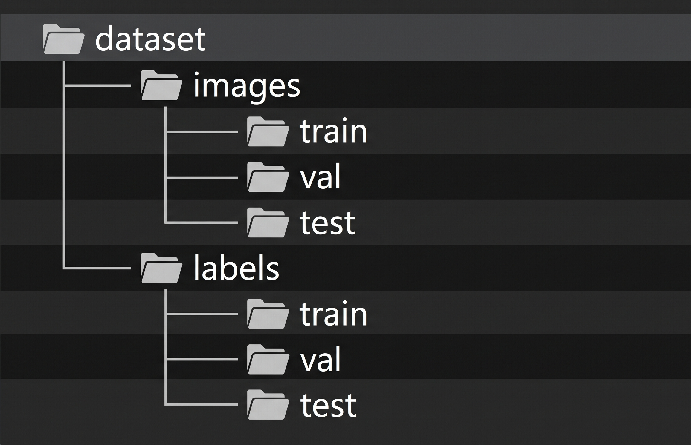

In this repository one can do object detection by yolo-v8 just replacing  the data set and the path

# create the folder where you are going to work
Go to the location where you want to do your object detection work
inside that put your data set. 

## Structure of Data-set
The data set must be in yolo format.
let us assume that the dataset folder name is "dataset"
The structure of the dataset must be same like given in the image bellow

inside the subfolders of images, images will be there and inside the subfolders of labels labelled files will be there.

when you clone this repository, dataset structure is provided here, you just see the format and restructure your dataset exactly like this. Replace the dataset with your dataset.
*** You must follow this structure because configuration file is made for this format ***

# installing the library

### you may create an virtual environment to avoid conflicts of library versions

first install the ultralytics library using pip command. _pip install ultalytics_
ultralytics contains the YOLO-v8. after installing this you are good to go.

# Configuring the config.yaml file
Configuring the config.yaml file is very necessary as all the training, testing and prection will be depending on this one file itsel for refering the images and labels.

In this config.yaml file you have to provide the absolute path of the dataset as example is provided for the path.
You don't have to do any thing for train, tes, val as the datset structure is previously made as of requirements.

nc denotes number of classes. you provide the number of classes as of your dataset
later provide the class names.

# Training the model
To train the mode now just run main.py

# Testing the model performance on test data
To test the model performance and get the performance matrices, you just run test.py

# predicting on the images
To predict on the images, you just run the predict.py
you also can predict on videos and as well as live camera. for that you have to change predict.py as of requirements. you will get the predicted images on runs/detect/predict folder that will be automatically created.

# To know the model complexity and parameters
To know the model parameters and the model summary run summary.py

# Datas during training
All the datas will be stored as of standard practices on the sepearte folders.
